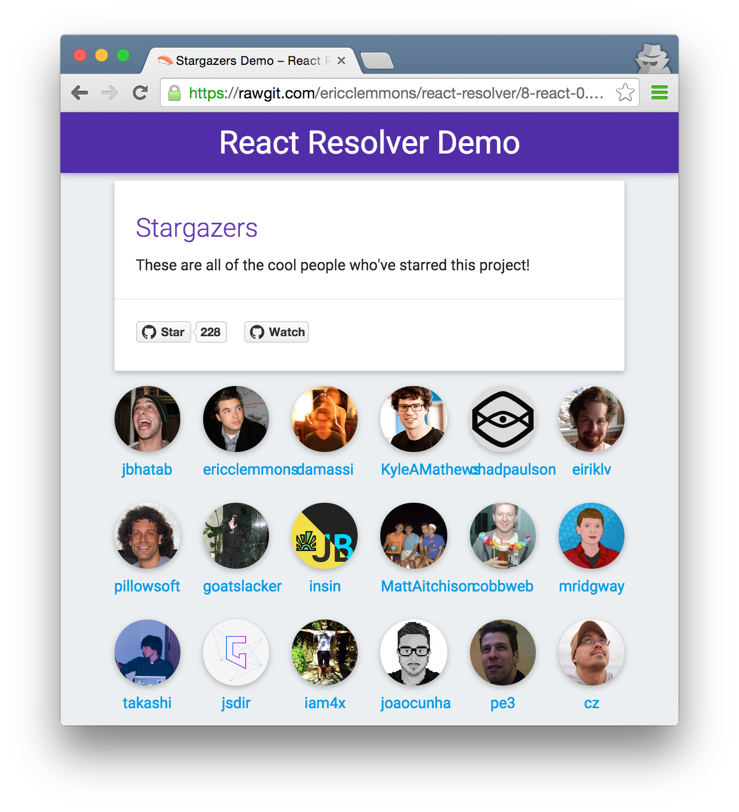

# React Resolver 

> Isomorphic library to lazy-load data for React components

[](https://github.com/ericclemmons/react-resolver/issues)
[](https://travis-ci.org/ericclemmons/react-resolver)
[](https://david-dm.org/ericclemmons/react-resolver#info=dependencies)

- - -
## Documentation

You're viewing the latest documentation on `master`.

You can choose a specific version's documentation here:

- [v1 Documentation][1]
- [v2 Documentation][2]

- - -

## Features

- **Promise-based** – Define & lazy-load component data dependencies and inject them as `props`.
- **Isomorphic** – Express/Koa/Hapi-friendly server-side rendering & progressive, client-side rendering.
- **Test friendly** – Containers promote separation between data-fetching & rendering.
- [**Upcoming Fixes & Features**][upcoming].


## Demo

> [][demo]

[View Demo][demo]


- - -


- [Features](#features)
- [Demo](#demo)
- [Dependencies](#dependencies)
- [Installation](#installation)
- [Usage](#usage)
  + [Client](#client)
  + [Server](#server)
- [Changelog][changelog]
- [Development](#development)
- [Authors](#authors)
- [License][license]

- - -


## Dependencies

- React `v0.13.x`

_For browsers that don't natively support Promises, use [ES6 Promises](https://github.com/jakearchibald/es6-promise)._


## Installation

```shell
npm install --save react-resolver
```

- - -

## Usage

_Example is based on [Stargazers.js](https://github.com/ericclemmons/react-resolver/blob/master/examples/stargazers/components/Stargazers.js) in the [demo][demo]._

Suppose you want to display list of users, but that data is loaded
asynchronously via an API.

Rather than having your component handle data-fetching _and_ rendering,
you can create a "container" that fetches the data and only renders when ready:

```javascript
import React from "react";
import { Resolver } from "react-resolver";

class Users extends React.Component {
  render() {
    return (
      <ul>
        {this.props.users.map(user => (
          <li>{user}</li>
        ))}
      </ul>
    );
  }
}

Users.defaultProps = { limit: 5 };
Users.propTypes = { users: React.PropTypes.array.isRequired };

// Rather than `export default Users`, create a container:
export default Resolver.createContainer(Users, {
  resolve: {
    users: function(props, context) {
      return fetch(`/api/users?limit=${props.limit}`);
    }
  }
});

```

If you use [React Router][router] (or anything else) that uses
`context`, you can get access to these values via:

```javascript
Resolver.createContainer(Users, {
  contextTypes: {
    router: React.PropTypes.func.isRequired
  },

  resolve: {
    user: function(props, context) {
      const { login } = context.router.getCurrentParams();

      return fetch(`/api/users/${login}`);
    }
  }
});

```

_For a working example of this, check out [User.js](https://github.com/ericclemmons/react-resolver/blob/master/examples/stargazers/handlers/User.js) in the [demo][demo]._


### Client

Replace `React.render` with `Resolver.render`, and you're all set!

```javascript
import React from "react";
import { Resolver } from "react-resolver";

Resolver.render(<Users />, document.getElementById("app"));
```

You may pass in a `Resolver` instance as the third argument to `Resolver.render`.

```js
var resolver = new Resolver();
Resolve.render(<Users />, document.getElementById("app"), resolver);
```

The `Resolver` instance exposes a few methods.

#### `await`(`<array> promises = []`)

Returns a promise after all promises (the resolves and the provided `promises`) have been *resolved*.

### Server

Because data has to be fetched asynchronously, `React.renderToString`
(and `React.renderToStaticMarkup`) won't have the data in time.

Instead, replace `React` with `Resolver` and you'll receive a promise
that resolves with the rendered output!

```javascript
import React from "react";
import { Resolver } from "react-resolver";

Resolver.renderToString(<Users />).then((string) => {
  reply(string);
}).catch((err) {
  // An error was thrown while rendering
  console.error(err);
});

```

- - -

## Development

If you'd like to contribute to this project, all you need to do is clone
this project and run:

```shell
$ npm install
$ npm test
```


## Authors

- [Eric Clemmons](mailto:eric@smarterspam.com>) ([@ericclemmons][twitter])


## [License][license]


## Collaboration

If you have questions or issues, please [open an issue][issue]!


[1]: https://github.com/ericclemmons/react-resolver/blob/v1/README.md
[2]: https://github.com/ericclemmons/react-resolver/blob/v2/README.md
[changelog]: https://github.com/ericclemmons/react-resolver/blob/master/CHANGELOG.md
[demo]: https://cdn.rawgit.com/ericclemmons/react-resolver/master/examples/stargazers/public/index.html
[issue]: https://github.com/ericclemmons/react-resolver/issues/new
[license]: https://github.com/ericclemmons/react-resolver/blob/master/LICENSE
[router]: https://github.com/rackt/react-router/
[twitter]: https://twitter.com/ericclemmons/
[upcoming]: https://github.com/ericclemmons/react-resolver/blob/master/CHANGELOG.md#upcoming
